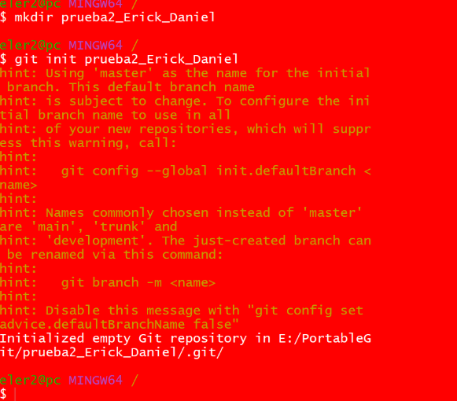
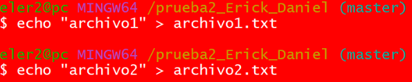
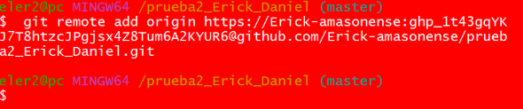
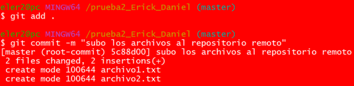
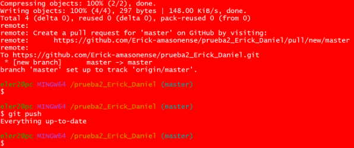
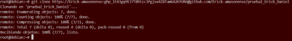
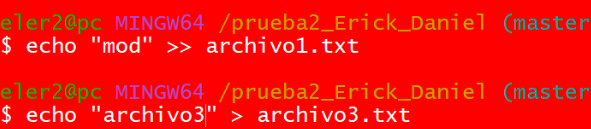
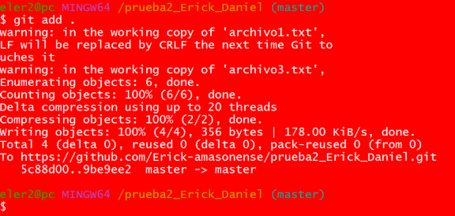
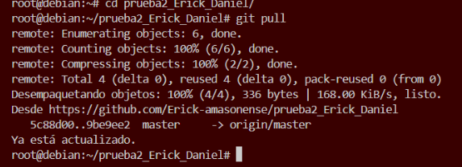

# Ejercicio 1: Vamos a crear un nuevo repositorio llamado prueba2_tu_nombre. Ten en cuenta lo siguiente: 

## En esta ocasión, crea primero el repositorio local en Windows (usando git init). El repositorio debe contener, al menos, dos archivos de texto: archivo1.txt y archivo2.txt. El contenido de ambos archivos es libre. 

Para crear el repositorio: 

Creo una carpeta con su nombre en mi caso “prueba2_Erick_Daniel” 

La convierto en un repositorio con el comando "git init y el nombre de la carpeta"

Creo los archivos con el comando "echo mensaje > archivo.txt"

## Agrega (conecta) el repositorio local con un repositorio remoto en GitHub (usando git remote add). 

conecto los repositorios con el comando "git remote add origin" y seguidamente introducimos la url del repositorio otorgando el usuario y el token de la manera en la que se observa en la imagen

Y autorizamos los cambios

## Sube el repositorio local a GitHub (usando git push). 

subiremos los cambios coen el comando "git push --set-upstream origin master"
Y luego un "git push"

## Clona el repositorio remoto en tu máquina virtual Linux Debian (usando git clone). 

Para clonar el repositorio con git clone, escribimos el comando junto al usuario y el token como se ve en la imagen

 

## Modifica, en Windows, uno de los archivos y añade un 3º archivo de texto llamado archivo3.txt. Confirma los cambios(usando git add, git commit) y súbelos al repositorio (usando git push).

Creamos (echo >) y modificamos (echo >>) los archivos y los autorizamos:

## Actualiza la versión local del repositorio en Linux Debian (usando git pull). 

Entramos en la carpeta del repositorio y escribimos git pull

