# Ejercicio 3 

## Crea un fichero en Markdown llamado ejercicio3.md con la información solicitada a continuación y sube el fichero al repositorio prueba_tu_nombre creado en el ejercicio 1 

### Crea una rama que se llame primera en un repositorio local, y ejecuta la instrucción necesaria para comprobar que se ha creado.

Creamos la rama "primera" con el comando "git branch primera"
Comprobamos entrando a la rama con "git checkout primera"

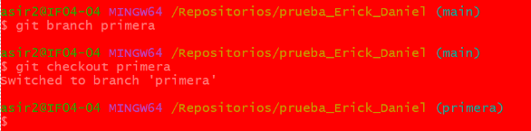

Y subimos los cambios al repositorio remoto con "git push origin primera"

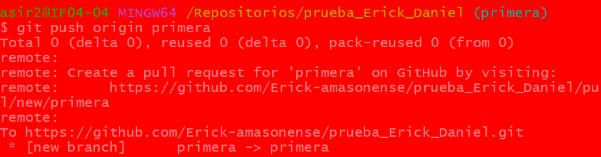
 

### Crea un nuevo fichero en esta rama y fusiónalo con la principal. ¿Se ha producido conflicto? Razona la respuesta. 

creo un documento vacio con "> prueba1.txt"
cambiamos a main

Fusionamos la rama main y primera con "git merge primera"

No hay conflicto, ya que no hay una contradicción entre archivos duplicados 

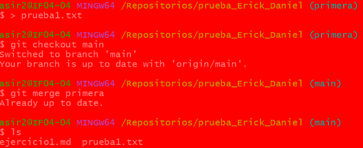

### Borra la rama primera. 

Eliminamos la rama con "git branch -D primera"
Y en el repositorio remoto con "git push origin --delete primera"

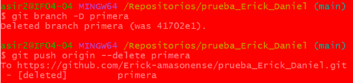

### Crea una rama que se llame segunda, y modifica un fichero en ella para producir un conflicto al unirlo a la rama principal. Entrega el contenido del fichero donde se ha producido el conflicto. 

Creo un archivo txt con un mensaje con "echo "Esto es España" > p.txt

lo autorizo en el repositorio utilizando los comandos "git add ." y "git commit -m p"

Creo un la rama segunda y cambio a la misma con el comando "git switch -c segunda"

Sobreescribo el archivo p.txt con otro mensaje y lo autorizo

Cambio a la rama main y cambio de nuevo el mensaje, autorizando seguidamente

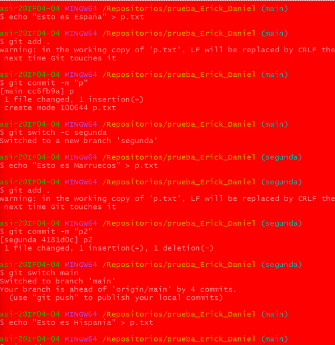

Finalmente fusiono las ramas y da error

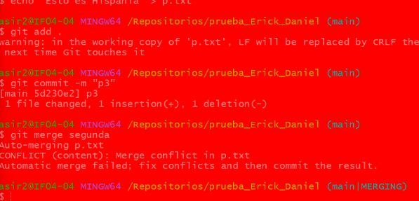

Entramos al documento y observamos lo que ha hecho git
 
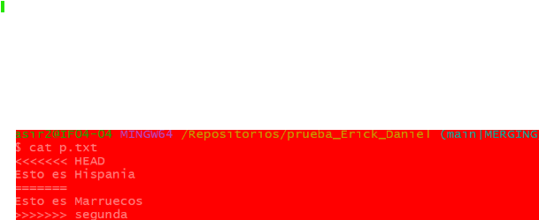
 

### Soluciona el conflicto que has creado en el punto anterior y sincroniza la rama segunda en el repositorio remoto en GitHub correspondiente. Entrega una captura de pantalla donde se vea que se ha creado la rama en el repositorio de GitHub. 

Para arreglar el conflicto tendremos que seleccionar lo que queramos conservar y eliminar lo demás, en mi caso eliminare “esto es Marruecos” 

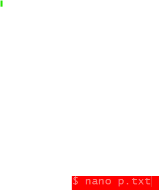

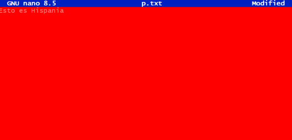

Ahora sincronizare la rama “segunda”	 

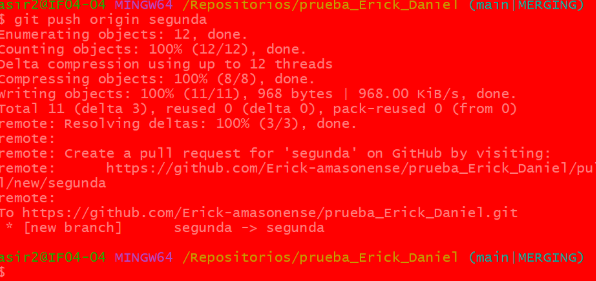

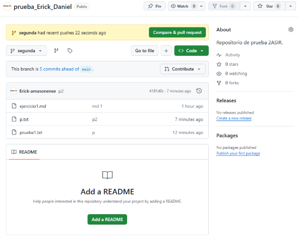

