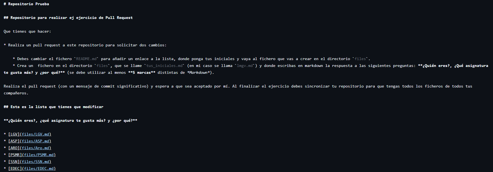
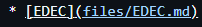
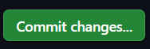
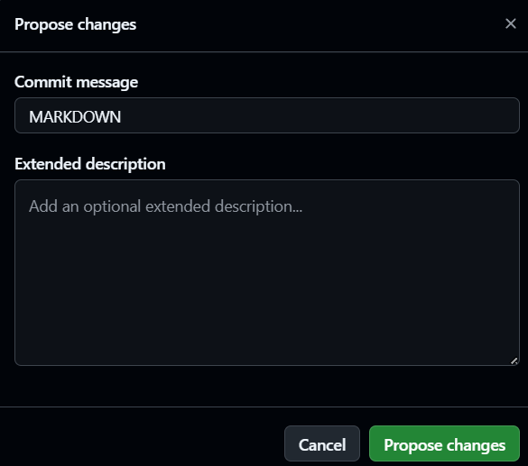
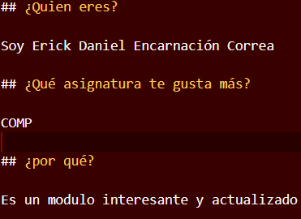
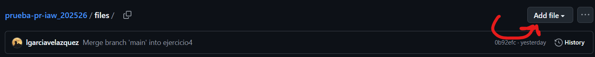
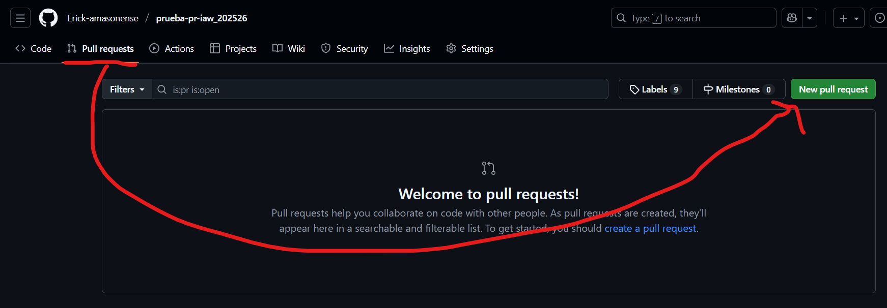
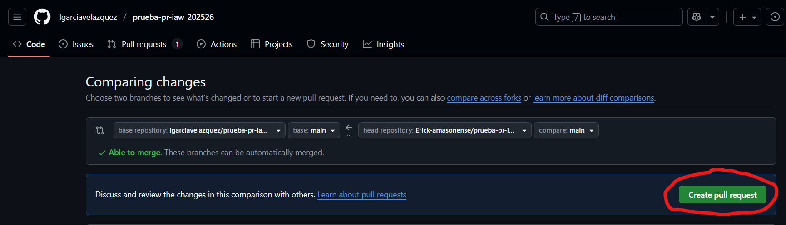
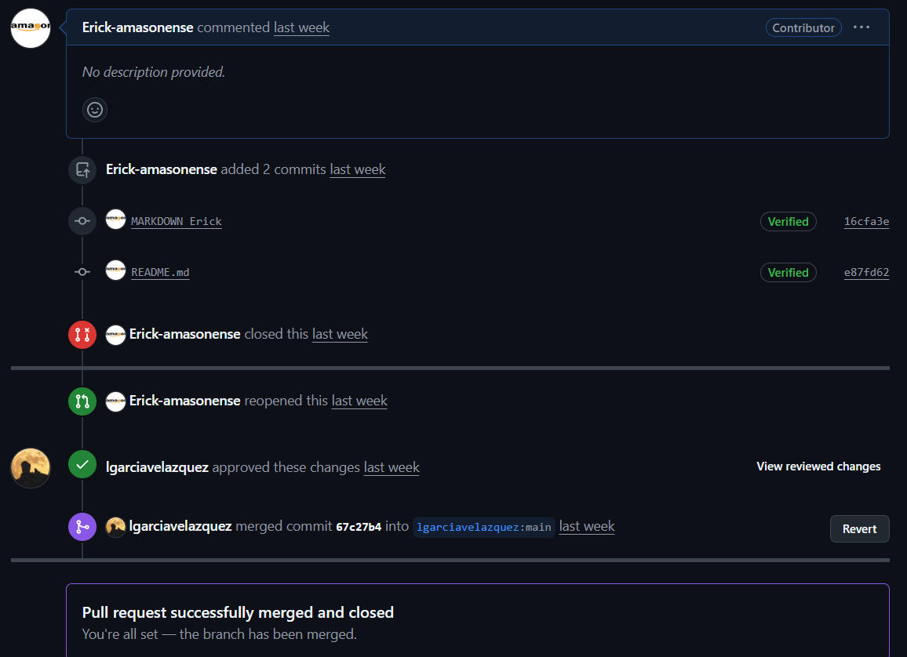

# Ejercicio 4

## Realiza un pull request a este repositorio para solicitar dos cambios: Nota: No olvides crear previamente una rama nueva sobre la que realizarás los cambios.

#### Debes cambiar el fichero README.md para añadir un enlace a la lista, donde ponga tus iniciales y vaya al fichero que vas a crear en el directorio files.

Una vez haber creado un fork modificaremos el readme:

Entre los corchetes escribire las iniciales y en el parentesis el enlace

Guardaremos los cambios

#### Crea un fichero en el directorio files, que se llame tus_iniciales.md (en mi caso se llama lmgv.md) y donde escribas en markdown la respuesta a las preguntas: ¿Quien eres?, ¿Qué asignatura te gusta más? y ¿por qué? (se debe utilizar al menos 5 marcas distintas de markdown).

Primero Creo el Markdown respondiendo a las preguntas 

Y seguidamente subo el archivo a la carpeta "files" realizando su respectivo commit

## Realiza el pull request (con un mensaje de commit significativo) y espera a que sea aceptado por mí. Al finalizar el ejercicio debes sincronizar tu repositorio para que tengas todos los ficheros de todos tus compañeros.

Iremos a "Pull requests"

Crearemos un nuevo Pull request

Y confirmamos

Finalmente esperaremos a la confirmación

